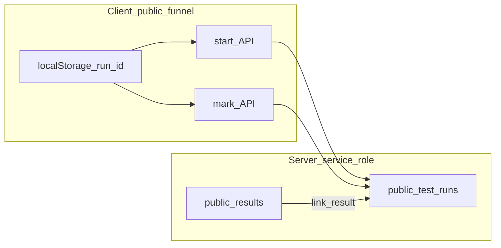

# PR-KPI-PUBLIC-TEST-RUNS-03 Plan

이 문서는 **설계(Plan) 전용**이다. 구현 완료를 의미하지 않으며, DB 마이그레이션·API·클라이언트 변경은 후속 PR(구현 단계)에서 수행한다.

---

## 1. Summary

- **목적**: `public_test_profiles`의 **latest-profile-per-anon** 한계로 깨지는 파일럿 KPI·반복 테스트 분리 문제를 보완하기 위해, public funnel을 **`public_test_run_id`(불변 run 단위)**로 추적할 기반을 설계한다.
- **핵심 결정(안)**  
  1. **MVP 데이터 모델**: 단일 테이블 `public_test_runs`에 **milestone 타임스탬프 컬럼(A안)** 을 두고, PR03에서는 확장 이벤트 테이블(B안)은 **후속 옵션**으로만 문서화한다.  
  2. **Run 생성 시점**: 무작위 크롤러·프리뷰 노이즈를 줄이면서도 KPI로 의미 있는 분해를 위해, **첫 “실제 진행 의도” 시점**으로 **`public_cta_clicked`(랜딩에서 테스트 시작 확정)** 직후 서버에 `start`(insert)를 호출하는 방식을 **권장 기본값**으로 둔다. `landing_viewed`만 한 세션은 기존처럼 **`analytics_events`만**으로 집계하고, 필요 시 후속으로 landing beacon을 추가한다.  
  3. **연결 전략**: `run_id`는 **클라이언트 생성 UUID + localStorage**로 보관하고, `public_result_id`·`user_id`는 **서버 확정 경로**(POST `/api/public-results`, POST `/api/public-results/[id]/claim`)에서 **best-effort**로 run row를 갱신한다.
- **산출물 분리**: 테이블·헬퍼(PR03A) → funnel 마킹·결과 연결(PR03B/C) → Admin KPI가 run 기반 attribution 우선(PR03D) 순으로 쪼개 회귀 리스크를 낮춘다.

---

## 2. CURRENT_IMPLEMENTED

- **분석 이벤트**: 클라이언트는 [`trackEvent`](/src/lib/analytics/trackEvent.ts)로 `/api/analytics/track`에 전송; anon은 [`getOrCreateAnonId`](/src/lib/public-results/anon-id.ts). 파일럿은 [`client-context`](/src/lib/analytics/client-context.ts)·[`pilot-context`](/src/lib/pilot/pilot-context.ts)·[`sanitizePilotCode`](/src/lib/pilot/pilot-code.ts) 경로.
- **Public 결과 저장**: POST [`/api/public-results`](/src/app/api/public-results/route.ts) → `createPublicResult` 후 [`linkPublicTestProfileToResult`](/src/lib/analytics/public-test-profile.ts)(best-effort).
- **Claim**: POST [`/api/public-results/[id]/claim`](/src/app/api/public-results/[id]/claim/route.ts) — 서버에서 인증된 `user_id`로 귀속, analytics 서버 이벤트 로깅.
- **Bridge**: [`public-result-bridge.ts`](/src/lib/public-results/public-result-bridge.ts) — `moveReBridgeContext:v1`에 `publicResultId`, `resultStage`, `anonId` 등 (실행 연속성 전용).
- **프로필 KPI**: [`public_test_profiles`](/supabase/migrations/20260502150000_public_test_profiles.sql) — **`anon_id` UNIQUE**, 최신 행만 의미 있음. demographics·pilot 일부는 여기서 조회 ([`admin-kpi-demographics`](/src/lib/analytics/admin-kpi-demographics.ts)).
- **Admin 파일럿 필터(PR02)**: [`filterRowsByPilotCode`](/src/lib/analytics/admin-kpi-pilot-filter.ts) — `props.pilot_code`, `public_test_profiles`, `signup_profiles` 조합.
- **`analytics_events`**: 스키마 변경 없이 observer 레이어로 유지 ([migration](/supabase/migrations/20260502140000_analytics_event_infra.sql)).

---

## 3. Problem

1. 동일 `anon_id`에서 테스트를 여러 번 하면 **`public_test_profiles` 한 행이 덮어써져** 과거 run과의 연결·파일럿 코드·`public_result_id` 링크가 사라진다.
2. Admin KPI 파일럿 필터는 프로필을 **latest 기준**으로 보므로, **동일 기기·여러 pilot 링크·여러 결과**를 run 단위로 분리하기 어렵다.
3. `analytics_events`만으로는 **의도적인 “한 번의 분석 시도”** 경계를 소스 오브 트루스로 삼기 어렵고, dedupe·세션 경계와 해석이 엇갈릴 수 있다.

---

## 4. Goals

- Public funnel의 분석 단위를 **`public_test_run_id`(불변)** 로 정의한다.
- 같은 브라우저/anon에서 **재시작 시 새 run row**가 생긴다.
- Run은 **가능한 한 일찍** 시작되어 이후 **survey / result / claim / (후속) session** 과 점진적으로 연결된다.
- 기존 **`public_test_profiles` 유지**, 기존 **대시보드·제품 UX 비변경**(설계 상 원칙; 구현 PR에서도 동일 가드).
- **Additive migration만**.

---

## 5. Non-goals

- 이번 Plan 문서만 작성 — **마이그레이션/API/UI 코드 변경 없음**.
- `public_test_profiles` 제거·역할 대체 강제 없음.
- `analytics_events` 컬럼 변경·`trackEvent` 전송 방식 변경 없음.
- `/app/home`, `SessionPanelV2`, `ExercisePlayerModal`, session create/complete, auth, payment **로직 변경 없음**(후속에서도 run 연결은 **부가 best-effort** 우선).

---

## 6. Proposed Data Model

### 6.1 테이블 후보 필드(사용자 제안 스키마 기준)

제안된 컬럼 목록은 파일럿 리포트には便利だが, **한 번에 전부 넣으면** (a) 마이그레이션·백필 부담, (b) `analytics_events`와의 **의미 중복**이 커진다.

### 6.2 A안 vs B안

| 구분 | A안: 단일 row + milestone columns | B안: `public_test_runs` + `public_test_run_events` |
|------|-----------------------------------|-----------------------------------------------------|
| 장점 | Admin 조인·리포트 단순, run 상태 한눈에 보임 | 마일스톤 추가 시 DDL 부담 적음, 동일 milestone 재발 이력 가능 |
| 단점 | 컬럼 증가·분석 이벤트와 중복 해석 필요 | KPI 쿼리 복잡, 구현·테스트 비용 큼, `analytics_events`와 역할 중복 |

**권장(MVP)**: **A안 우선**. 코드베이스는 이미 `analytics_events`에 세분 이벤트가 쌓이므로, **run 테이블은 “코호트 단위 요약·링크(id 매핑)”** 에 집중하고, 세부 빈도는 analytics에 맡긴다. B안은 **후속**으로 “운영 디버그 전용 이벤트 로그”가 필요해질 때 검토.

### 6.3 MVP 최소 컬럼(제안)

필수로 두어야 하는 것:

- `id` uuid PK  
- `anon_id` text not null  
- `pilot_code` text null (항상 [`sanitizePilotCode`](/src/lib/pilot/pilot-code.ts) 통과 값만)  
- `source` text not null default `'public_funnel'`  
- `started_at` timestamptz not null default now() — **run row 생성 시각**  
- `created_at` / `updated_at` timestamptz  

**초기 마일스톤(MVP 권장)** — PR03B에서 채우기 시작:

- `cta_clicked_at` (또는 `funnel_started_at` 명칭 통일)  
- `survey_started_at`, `survey_completed_at`  
- `refine_choice` text null  
- `camera_started_at`, `camera_completed_at` (카메라 경로만)  
- `result_viewed_at`, `result_stage` text null  
- `public_result_id` uuid null FK → `public_results(id)`  

**PR03C 이후(또는 PR03C 범위에서 best-effort)**:

- `execution_cta_clicked_at`  
- `claimed_at`, `user_id` uuid null FK → `auth.users`  
- post-auth는 **선택**: `auth_success_at`, `checkout_success_at`, `onboarding_completed_at`, `session_create_success_at`, `first_app_home_viewed_at`, `first_session_complete_success_at`  

**해석**: 위 후반 컬럼은 `analytics_events`와 중복되지만, **“해당 run에 연결된 사람·결과”** 를 한 행에서 보기 위한 **요약 캐시**로 두고, 정합성은 analytics와 주기적 검증으로 본다.

### 6.4 선택 필드(운영·디버그)

- `entry_path` text null, `entry_referrer` text null — **PII 금지**, URL path 길이 제한·truncate 정책 필요  
- `landing_viewed_at` — **선택**: landing에서 beacon 추가 시에만  

### 6.5 인덱스(제안)

- `(pilot_code, started_at desc)` WHERE pilot_code IS NOT NULL — 파일럿 리포트  
- `(anon_id, started_at desc)` — 동일 anon 다중 run  
- `(public_result_id)` WHERE public_result_id IS NOT NULL  
- `(user_id, started_at desc)` WHERE user_id IS NOT NULL  

RLS: **`public_test_profiles`와 동일 패턴** — 클라이언트 직접 접근 없음, **service role/API 서버만 쓰기**(기존 analytics·admin 패턴 정렬).

---

## 7. Proposed API Contract

원칙: **인증 불필요한 start/mark**, **user_id는 서버 인증으로만**, 실패 시 **public funnel 차단 없음**.

### 7.1 후보 엔드포인트

| Route | 역할 |
|-------|------|
| `POST /api/public-test-runs/start` | run row insert (idempotent): body에 `run_id`, `anon_id`, 선택 `pilot_code`, `entry_path`, `referrer` |
| `POST /api/public-test-runs/mark` | milestone 단일/배치 갱신 (예: `survey_started`) |
| `POST /api/public-test-runs/link-result` | `public_result_id`, `result_stage`, 선택 타임스탬프 |
| `POST /api/public-test-runs/link-user` | **비권장 단도 공개** — user는 클라이언트 신뢰 불가 |

**통합 대안**: `POST /api/public-test-runs/sync` 한 개로 `action: 'start' | 'mark' | 'link_result'` — 라우트 수 감소. MVP에서는 **start + mark** 두 개만 두어도 충분.

### 7.2 서버에서만 할 일

- **Claim 후**: 기존 [`claim`](/src/app/api/public-results/[id]/claim/route.ts) 핸들러 내부에서 **동일 트랜잭션 또는 직후 best-effort** 로 `public_test_runs` 의 해당 run을 `public_result_id` 또는 서버 조회로 역추적해 `user_id`, `claimed_at` 설정 (설계상 후속 PR03C).

### 7.3 검증

- `anon_id`: 기존 public result와 동일하게 길이·형식 검증 ([`isValidAnonIdForPublicTestProfile`](/src/lib/analytics/public-test-profile.ts) 재사용 또는 공통 헬퍼).
- `run_id`: 클라이언트 생성 UUID, 서버는 insert 시 그대로 PK 또는 별도 `client_run_id` unique — **충돌 시 idempotent no-op**.

---

## 8. Client Flow / Run Lifecycle

### 질문 1 답: Run은 언제 생성되는가?

| 후보 | 장점 | 단점 |
|------|------|------|
| `landing_viewed` | 유입 전 단계 KPI(run 테이블 기준) 극대화 | 크롤러·OG 프리뷰·봇으로 **DB write 폭증** |
| **`public_cta_clicked`(권장)** | “테스트를 시작하겠다”는 **명확한 의도**, bots 일부 제거 | 랜딩만 하고 이탈은 run 테이블에 안 남음 → **landing KPI는 analytics 유지** |
| intro/profile submit | 프로필 완료 코호트 명확 | 설문 전 이탈 분해 약화 |
| `survey_started` | 반복 분리·구현 단순 | CTA↔설문 사이 이탈이 run 단위로 안 보임 |

**선택**: **MVP = `public_cta_clicked` 시점에 `run_id` 생성 + `/start` 호출**. 랜딩 유입 수는 기존 `landing_viewed` 이벤트로 유지. 이후 필요 시 **`landing_viewed` 전용 lightweight row 없이** `mark`만 하는 옵션 검토.

### 질문 2 답: Run id 보관

| 방식 | 평가 |
|------|------|
| **localStorage (권장)** | UX 변경 최소, 오프라인 재방문에도 유지. 키 예: `moveRePublicTestRun:v1` = `{ runId, startedAt }` |
| Cookie | 도메인·만료 정책 필요, PWA와 교차 이슈 |
| URL query | UX·공유 링크에 노이즈, SSOT 위반 가능성 |
| Bridge context | 결과 이후 유용하나 **run 시작은 더 이른 시점** 필요 → **혼합**: localStorage primary + claim/onboarding 시 서버 링크 |

원칙 준수: **UUID만**, 없으면 **조용히 새 run 생성 또는 마킹 스킵**, 플로우 **차단 금지**.

### 질문 10 일부: 반복 테스트 분리 기준

- **새 run 트리거**: 오늘와 동일하게 pilot 시작 시 [`clearPublicPreAuthTempStateForPilotStart`](/src/lib/pilot/pilot-context.ts) 호출 경로에서 **기존 run 키 클리어 + 새 UUID** (구현 세부는 PR03B).
- **결과 페이지만 재방문**: `persistPublicResult`/handoff 복구만으로는 **새 run 생성하면 안 됨** — “새 분석 시도” 플래그가 있을 때만.

---

## 9. Public Result / Claim Linkage

### 9.1 Result 생성 지점

[`POST /api/public-results`](/src/app/api/public-results/route.ts): 이미 `anonId`, `output.id` 존재. **제안**:

- Request body에 **선택** `publicTestRunId`(UUID) 추가 — 클라이언트가 localStorage에서 전달.
- 서버에서 **sanitize + 해당 run의 anon_id 일치 검증 후** `public_test_runs.public_result_id`, `result_stage`, `result_viewed_at`(선택) 업데이트 — **불일치 시 무시**(플로우 계속).

### 9.2 클라이언트 결과 페이지

[`baseline/page.tsx`](/src/app/movement-test/baseline/page.tsx), [`refined/page.tsx`](/src/app/movement-test/refined/page.tsx): `persistPublicResult` 호출 시 **동일 run id를 함께 실어** 보내도록 설계(구현은 PR03B).

### 9.3 Bridge 정합성

[`saveBridgeContext`](/src/lib/public-results/public-result-bridge.ts): run id를 bridge에 **중복 저장할지** 선택 사항. 최소는 **localStorage run 키 단일 SSOT**로 두고 bridge는 기존 계약 유지.

### 9.4 Claim

[`claim/route.ts`](/src/app/api/public-results/[id]/claim/route.ts): `public_result_id` + 인증 `user_id` 확정 후:

- `public_results` 업데이트와 동일 트랜잭션 또는 직후, **`public_result_id`로 run 조회**해 `user_id`, `claimed_at` 설정 (여러 run에 같은 result가 매달리면 안 되도록 — 보통 1:1 기대, 없으면 최근 run anon 매칭 등 정책 문서화).

---

## 10. Admin KPI Integration Plan

### 우선순위(목표 상태)

1. `public_test_runs.pilot_code` (+ run id 매칭)  
2. `analytics_events.props.pilot_code`  
3. `public_test_profiles.pilot_code`  
4. `signup_profiles.pilot_code`  

### 전환 전략

- **PR03D에서** [`filterRowsByPilotCode`](/src/lib/analytics/admin-kpi-pilot-filter.ts) 에 **run 테이블 조회 레이어** 추가: 이벤트 row의 `anon_id`/`public_result_id`/`user_id`/시간 윈도우로 **해당 pilot의 run set**을 만들고, **person/event가 그 run에 속하면 포함**하는 규칙 정의.
- **PR02 동작 유지**: run 매칭 실패 시 **현재와 동일한 fallback** 유지 → 대시보드 깨짐 방지.
- 대시보드 **메타**: 선택적으로 “attribution: runs+X fallback” 카운트(구현은 PR03D 선택).

**판단**: PR03에서 **한 번에 admin-kpi 변경까지 넣지 말고 PR03D로 분리**하는 것이 회귀·테스트 부담을 줄인다.

---

## 11. Migration Plan

1. **Additive-only** `create table public_test_runs` + 인덱스 + RLS enable + comment.  
2. FK: `public_result_id` → `public_results`, `user_id` → `auth.users` (기존 패턴 정렬).  
3. **백필 없음**(신규만); 과거 데이터는 analytics·profiles로 계속 조회.  
4. 운영 배포: 마이그레이션 → 서버 헬퍼 배포 → 클라이언트 start/mark 배포 순 권장.

---

## 12. PR Split Recommendation

| PR | 범위 | 위험도 | 구현 모델 메모 |
|----|------|--------|----------------|
| **PR03A** | 테이블 + 서버 헬퍼(insert/mark/link stub) + smoke | 낮음 | Composer 2.0 가능 |
| **PR03B** | 랜딩 CTA 이후 run id 생성·localStorage·start/mark·결과 POST에 run 전달 | 중간 | Plan 후 Composer 2.0 또는 Sonnet |
| **PR03C** | claim·user linkage·(선택) execution/auth/session milestones | 중간~높음 | Sonnet 권장 |
| **PR03D** | Admin KPI가 run 기반 attribution 우선 + fallback | 중간 | Composer 가능, 쿼리 회귀 검증 필수 |

---

## 13. Risks & Mitigations

1. **랜딩/봇으로 DB write 증가** — MVP는 CTA 시점 insert로 완화; 필요 시 rate limit·UA 휴리스틱·`started_at` 일 단위 중복 억제는 **비제품 정책**으로 문서화만.  
2. **OG 프리뷰·카카오 스크래퍼** — run 생성을 **사용자 제스처 이후**로 두어 노이즈 감소.  
3. **localStorage 삭제** — run id 소실 시 **신규 run**(중복 가능); KPI는 analytics와 병행 해석.  
4. **run과 result 1:N 혼동** — 서버에서 `anon_id`+타임윈도우로 단일 run 우선 매칭 규칙 명시.  
5. **이중 진실(analytics vs runs)** — runs는 **파일럿 코호트·링크**, 세부 이벤트는 analytics SSOT 유지.

---

## 14. Acceptance Tests

### Data model

- 동일 `anon_id`로 두 번 “새 테스트” 시작 시 **`public_test_runs` 행 2개**, 서로 다른 `id`.
- `pilot_code`는 sanitize된 값만 저장.
- `public_result_id`가 해당 run에 연결됨.
- Claim 후 `user_id`, `claimed_at` 연결(해당 result와 매칭된 run).

### Public flow

- Run API 실패 시에도 설문·결과·실행 플로우 **차단 없음**.
- localStorage에 활성 `run_id` 존재(구현 키명 명세화).
- 결과 **재조회만**으로 불필요한 새 run이 생기지 않음(부정 테스트).

### KPI

- 특정 `pilot_code`로 run 필터 시 **동일 anon의 다른 pilot run과 섞이지 않음**(PR03D 이후).
- post-auth 이벤트는 **run linkage**로 pilot attribution 가능해질 수 있음; 실패 시 PR02 fallback.

---

## 15. Verification Plan

구현 PR에서 예상 실행:

- `npm run test:analytics-kpi-pilot-filter`
- `npm run test:analytics-pilot-attribution-dedupe`
- `node scripts/public-test-runs-smoke.mjs` (PR03A 이후 신규)
- `npx tsc --noEmit`

`npm run lint`는 Next 16 환경 이슈가 있을 수 있음 — **변경 파일 관련 오류만** 실패로 간주하고 기존 전역 오류는 분리 보고.

---

## 16. Open Questions

1. **Run PK**: 클라이언트 생성 UUID를 그대로 PK로 쓸지 vs 서버 `gen_random_uuid` + `client_run_id` unique 컬럼으로 분리할지.  
2. **`entry_path`/`referrer` 저장 여부** — 트렁케이션 길이와 PII 미포함 계약.  
3. **카메라 없이 baseline만** 올 때 milestone 이름 통일(`camera_*` null vs 스킵).  
4. **Claim 시 다중 run 매칭** 시 우선순위(최근 `started_at`, 미완료 run 우선 등).  
5. **GDPR/삭제**: `auth.users` 삭제 시 run orphan 정책(FK ON DELETE SET NULL 등).

---

## 부록: 권장 PR Split 예시 (요약)

- **PR03A** — `public_test_runs` 테이블 + 서버 헬퍼 + smoke / UI 변경 없음  
- **PR03B** — public funnel `start`/`mark`/`link-result`(결과 API 확장) + localStorage run id  
- **PR03C** — claim 경로에서 user linkage + (안전하면) post-auth milestone 컬럼 채움  
- **PR03D** — Admin KPI pilot filter에 **run 테이블 우선** + 기존 PR02 fallback 유지 + 선택 메타

---

## Verification (본 문서 작업에 대한 확인)

- 설계서 경로: [`docs/pr/PR-KPI-PUBLIC-TEST-RUNS-03.plan.md`](PR-KPI-PUBLIC-TEST-RUNS-03.plan.md)
- 본 작업 범위에서는 **코드·마이그레이션 수정 없음**(문서만).
